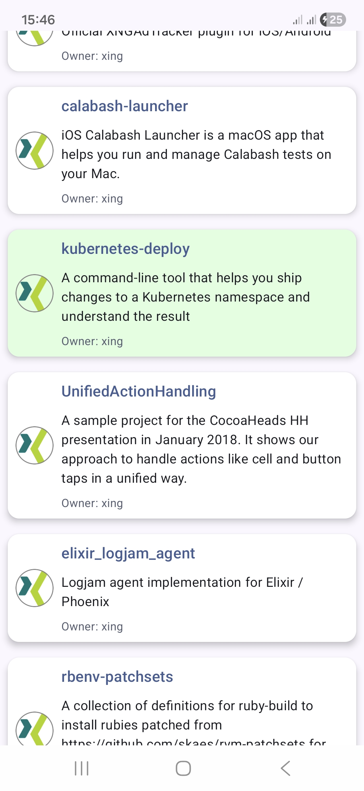
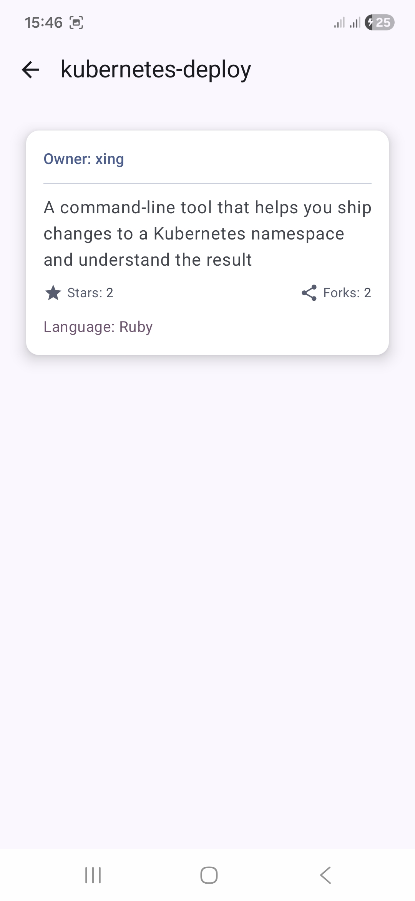

# Xing

In the application, the data is fetched from a remote API and displayed in a scrollable list. Users can tap any item to view its detailed information on a separate screen. The app supports offline usage by caching the last fetched data locally, ensuring that content is available even without an internet connection. It is built using **Clean Architecture** and the **MVVM pattern**, leveraging modern Android development practices for maintainability and testability.

## Features

- Fetches data from a remote API using **Retrofit** (high-level) and **OkHttp** (low-level)
- Converts JSON responses to Kotlin data classes with **Kotlinx-serialization**
- Caches data locally using **Paging 3** with **Room Database** (for scenarios without caching, it is better to use a custom pagination solution instead of Paging 3)
- Efficiently loads paginated data via **RemoteMediator** and **PagingSource**
- Displays data in a scrollable list using **Jetpack Compose LazyColumn**
- Pull-to-refresh support for the list
- Shows item avatars with **Coil** image loading library
- Offline support with cached data
- Simple navigation between the list and detail screens
- Dependency injection using **Koin**
- Unit tests for API, Repository, and ViewModel layers
- UI tests for both list and detail screens

## Architecture

- **MVVM (Model-View-ViewModel):** Ensures separation of concerns and testability
- **Clean Architecture:** Organized into layers — Data, Domain, and UI
- **Repository Layer:** Provides a Pager linking RemoteMediator and PagingSource
- **RemoteMediator:** Fetches data from API and stores it in Room Database
- **ViewModel:** Consumes Pager and emits data to the UI layer

## Tech Stack

- **Language:** Kotlin
- **UI:** Jetpack Compose
- **Networking:** Retrofit, OkHttp
- **Serialization:** Kotlinx-serialization
- **Caching/Pagination:** Paging 3, Room Database
- **Dependency Injection:** Koin
- **Image Loading:** Coil
- **Testing:**
  - Unit tests: MockWebServer, mockk, AsyncPagingDataDiffer
  - UI tests: Jetpack Compose testing

## ScreenShot

  
  

